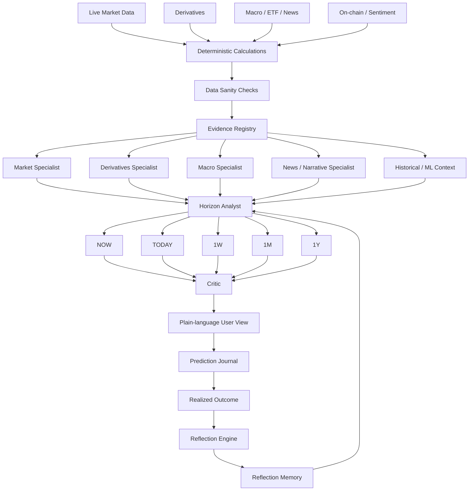

# ₿ BitScope — Real-Time Multi-Agent Bitcoin Market Intelligence

<p align="center">
  <strong>Live market data → specialist analysis → multi-horizon reasoning → critique → reflection memory.</strong><br/>
  A Bitcoin research agent built to keep the internals complex and the final answer simple.
</p>

<p align="center">
  <a href="https://LeeJaeHoon1234.github.io/btc-agent/"></a>
  <a href="https://leejaehoon1234-btc-agent-api.onrender.com/docs"></a>
</p>

<p align="center">
  <a href="https://github.com/LeeJaeHoon1234/btc-agent/actions/workflows/test.yml"></a>
  <a href="https://github.com/LeeJaeHoon1234/btc-agent/actions/workflows/deploy-pages.yml"></a>
  
  
  
  
</p>

---

## What is BitScope?

**BitScope V4.1** is a real-time, multi-agent Bitcoin market analysis and decision-support system. It combines **live BTC market microstructure, technical indicators, derivatives, macro data, news/sentiment, on-chain context, LightGBM, and LLM reasoning** into one readable answer across five different horizons:

**NOW · TODAY · 1W · 1M · 1Y**

Instead of asking one LLM to search, calculate, and trade at the same time, BitScope separates the workflow:

> **Python calculates facts. Specialists interpret domains. The final agent resolves conflicts. A critic checks the answer. Reflection memory evaluates what happened later.**

The project is intentionally a **decision-support/research system**, not an automated trading bot.

## Why this project is different

| Problem | BitScope V4.1 approach |
|---|---|
| A daily signal misses an intraday crash or rebound | Live Upbit WebSocket + intraday indicators + event detection |
| One score hides why the market looks bullish/bearish | Evidence registry + domain-specific specialists |
| `NOW` and `1M` should not use the same reasoning | Separate horizon analysis for NOW / TODAY / 1W / 1M / 1Y |
| LLMs can invent or alter market facts | Deterministic calculations first; LLMs reason only from supplied evidence |
| A live price can be fresh while the AI analysis is stale | Price freshness and AI-analysis freshness are displayed separately |
| Raw metrics like `1H -0.3%` are hard to read | Plain-language interpretation + intraday range + sparklines |
| Agents repeat the same mistakes every day | Prediction Journal + horizon-specific outcome evaluation + Reflection Memory |
| Historical feedback can overfit current decisions | Current market data always outranks memory |

## Live experience

### Korean / English in one app

BitScope ships as a single bilingual application. Use the **KR | EN** toggle in the header; the preference is saved locally, and the final horizon analysis / user-facing AI explanation is regenerated in the selected language.

### Real-time market layer

- Browser-live **BTC/KRW** price through Upbit WebSocket
- Independent **BTC/USD** reference price
- True rolling **1H / 4H / 24H** returns
- Intraday low/high range and current position
- Order-book imbalance, spread and spot taker flow
- Volume, VWAP gap, realized volatility and fast RSI/EMA/MACD context
- Deterministic event detection for flushes, rebounds, volume shocks and leverage crowding

### Five different questions, not one repeated forecast

| Horizon | Main question |
|---|---|
| **NOW** | What is happening right now, and is the move trustworthy? |
| **TODAY** | What is the structure of today's move? |
| **1W** | Is short-term trend/risk improving or deteriorating? |
| **1M** | What do trend, derivatives, macro, flows and ML imply together? |
| **1Y** | Where is Bitcoin in the broader cycle and structural environment? |

## Architecture



### Design principle

```text
Complex inside, simple outside.
```

The user should not have to inspect 30 indicators to understand the result. The system may calculate many signals internally, but the main UI surfaces only the evidence that materially matters to the current horizon.

## V4.1: the agent can evaluate its past decisions

Every horizon decision can be written to a **Prediction Journal** with its timestamp, stance, confidence, market regime and selected evidence.

After the relevant horizon matures, BitScope compares the original decision with the realized market move:

```text
Decision
   ↓
Time passes
   ↓
Realized BTC outcome
   ↓
Performance evaluation
   ↓
Reflection
   ↓
Structured lesson memory
   ↓
Relevant context for a future similar market
```

Evaluation windows are intentionally horizon-specific:

| Decision | Evaluation delay |
|---|---:|
| NOW | 4 hours |
| TODAY | 24 hours |
| 1W | 7 days |
| 1M | 30 days |
| 1Y | 365 days |

Reflection is a **weak prior**, not an automatic parameter optimizer. It cannot silently change RSI thresholds, model weights, prices or realized returns. Fewer than three historical samples are treated as insufficient evidence.

## Data and reasoning layers

### Fast / live layer

`price · returns · day range · volume · VWAP · order book · taker flow · volatility · intraday events`

### Derivatives

`funding · open interest · OI change · long/short ratios · taker flow · basis`

### Daily / trend layer

`MA / EMA · RSI · MACD · Bollinger Bands · ATR · ADX · stochastic · OBV · drawdown · realized volatility`

### Broader context

`macro · ETF flows · sentiment · news · network/on-chain context · historical similarity · cycle context`

### ML

A LightGBM model provides a **30-day support signal**. It is deliberately not treated as the final decision-maker; weak model performance cannot dominate the multi-source market evidence.

## Reliability and guardrails

BitScope is designed around the assumption that **market data and LLM output can both fail**.

The live layer validates, among other things:

- valid/positive prices
- `high >= low`
- current price consistency with the reported intraday range
- ticker vs latest candle divergence
- KRW and USD reference-price consistency
- source freshness and unavailable-data states

LLM components receive structured evidence IDs and are instructed not to invent or modify market values. If an LLM, source, quota or network call is unavailable, deterministic fallbacks keep the API usable.

## Tech stack

| Layer | Technology |
|---|---|
| Frontend | React 19, Vite, browser WebSocket, SVG charts |
| Backend | FastAPI, Python 3.12 |
| Market data | Upbit + public market/research APIs |
| ML | LightGBM |
| AI reasoning | LLM specialist / horizon / critic / writer pipeline |
| Deployment | GitHub Pages + Render + Docker |
| CI | GitHub Actions |
| Persistence | JSON journal by default; persistent disk/DB recommended for long-running memory |

## API

| Endpoint | Purpose |
|---|---|
| `GET /health` | Service and capability status |
| `GET /api/v1/live` | Fast market snapshot without an LLM call |
| `POST /api/v1/analyze` | Full five-horizon analysis |
| `GET /api/v1/journal` | Prediction / reflection history |
| `GET /api/v1/usage` | Anonymous process-local quota state |

**Interactive API docs:** https://leejaehoon1234-btc-agent-api.onrender.com/docs

## Run locally

<details>
<summary><strong>Backend</strong></summary>

```bash
python -m venv .venv
source .venv/bin/activate  # Windows: .venv\\Scripts\\activate
pip install -r requirements.txt
uvicorn backend.main:app --reload
```

Copy `.env.example` to `.env` and configure the required API/environment values.

</details>

<details>
<summary><strong>Frontend</strong></summary>

```bash
cd frontend
npm install
npm run dev
```

Set the backend URL using the frontend environment configuration in `frontend/.env.example`.

</details>

## Verification

```bash
python -m pytest -q
```

V4.1 backend validation target:

```text
23 passed
```

Frontend production build:

```bash
cd frontend
npm run build
```

## Repository docs

- [`V4_1_ARCHITECTURE.md`](V4_1_ARCHITECTURE.md) — V4.1 architecture notes
- [`V4_1_ROLLOUT.md`](V4_1_ROLLOUT.md) — upgrade and deployment guide
- [`V4_1_MANIFEST.md`](V4_1_MANIFEST.md) — V4.1 change manifest
- [`V4_ARCHITECTURE.md`](V4_ARCHITECTURE.md) — previous V4 architecture

## Roadmap

- Durable Reflection Memory using persistent storage
- Regime × specialist performance matrix with statistically meaningful sample gates
- Richer on-chain/network activity for 1M/1Y horizons
- Outcome-based evaluation: calibration, drawdown, downside/upside capture and transaction-cost-aware portfolio simulation
- Improved narrative-event classification and source-quality scoring

## Disclaimer

This repository is a **research and decision-support project**. It does not execute trades and does not provide guaranteed investment returns. Market data may be delayed, incomplete, unavailable or inconsistent, and model outputs can be wrong.

## License

Copyright © 2026 Jaehoon Lee. All rights reserved unless otherwise stated in the repository's `LICENSE` file.

---

<p align="center">
  <strong>If you find the architecture or implementation useful, consider starring the repository.</strong><br/>
  <a href="https://LeeJaeHoon1234.github.io/btc-agent/">Try BitScope live →</a>
</p>
