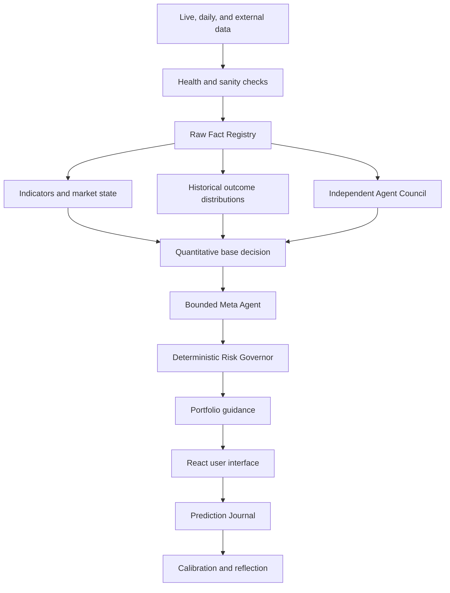

# BitScope - Bitcoin decision intelligence

<p align="center">
  <strong>Live market data · specialist analysis · horizon forecasts · critique · reflection</strong><br/>
  Complex inside, simple outside.
</p>

<p align="center">
  <a href="https://LeeJaeHoon1234.github.io/btc-agent/"></a>
  <a href="https://leejaehoon1234-btc-agent-api.onrender.com/docs"></a>
</p>

<p align="center">
  <a href="https://github.com/LeeJaeHoon1234/btc-agent/actions/workflows/test.yml"></a>
  <a href="https://github.com/LeeJaeHoon1234/btc-agent/actions/workflows/deploy-pages.yml"></a>
  
  
  
</p>

## What BitScope does

BitScope V5.1.0 automates the research workflow a Bitcoin market analyst would otherwise repeat manually:

1. Collect live, daily, derivatives, macro, ETF, sentiment, news, and network data.
2. Validate freshness, availability, and cross-source consistency.
3. Compute indicators, market state, historical analogs, and return distributions in Python.
4. Let independent specialist agents interpret only the evidence supplied to them.
5. Challenge the result with a critic and cap risk through deterministic rules.
6. Present a compact view for `NOW`, `TODAY`, `1W`, `1M`, and `1Y`.
7. Journal forecasts and evaluate them after each horizon matures.

The project is a research and decision-support system. It does not execute trades.

## V5.1 principle

> Python calculates facts and forecast distributions. Language agents interpret and challenge. A deterministic Risk Governor owns the safety boundary.

BitScope does not train or load a price-prediction model. Numerical forecasts come from observable market state and comparable historical outcomes. Every forecast exposes its sample size, dispersion, downside quantiles, confidence, and calibration status.

This keeps the numerical layer reproducible and prevents an unstable trained model from silently influencing allocation.

## Architecture


```mermaid
flowchart TD
    A[Live, daily, and external data] --> B[Health and sanity checks]
    B --> C[Raw Fact Registry]
    C --> D[Indicators and market state]
    C --> E[Historical outcome distributions]
    C --> F[Independent Agent Council]
    D --> G[Quantitative base decision]
    E --> G
    F --> G
    G --> H[Bounded Meta Agent]
    H --> I[Deterministic Risk Governor]
    I --> J[Portfolio guidance]
    J --> K[React user interface]
    K --> L[Prediction Journal]
    L --> M[Calibration and reflection]
```

### Decision boundaries

- Raw facts do not carry hidden bullish or bearish labels into the agent layer.
- Deterministic priors are used only when an independent specialist is unavailable.
- The Meta Agent can move the quantitative target by at most 10 percentage points.
- The Risk Governor can only cap or block exposure; it cannot increase it.
- Missing or stale data remains explicit.

## Data and reasoning layers

| Layer | Evidence |
|---|---|
| Live | BTC/KRW, BTC/USD reference, rolling returns, range, order book, taker flow, VWAP, volatility |
| Derivatives | Funding, open interest, basis, long/short ratios, futures taker flow |
| Daily | MA/EMA, RSI, MACD, Bollinger Bands, ATR, ADX, stochastic, OBV, drawdown |
| Context | Macro, ETF flows, sentiment, news, network activity, cycle context |
| Forecast | Historical analog outcomes, expected return, quantiles, probability up, dispersion |
| Reasoning | Technical, derivatives, flow, macro, news, historical, critic, and risk agents |

## Forecast evaluation

The Prediction Journal freezes each live forecast at decision time. Matured outcomes are evaluated with:

- direction accuracy;
- Brier score;
- expected-return error;
- q10-q90 interval coverage;
- horizon-specific performance.

Reflection is a weak prior. It cannot rewrite prices, thresholds, realized outcomes, or portfolio constraints.

## Web application

There is one frontend: React + Vite deployed to GitHub Pages. The FastAPI backend runs on Render.

| Surface | Location |
|---|---|
| Public site | https://LeeJaeHoon1234.github.io/btc-agent/ |
| API docs | https://leejaehoon1234-btc-agent-api.onrender.com/docs |
| Frontend source | `frontend/` |
| Backend source | `backend/` and `src/` |

## API

| Endpoint | Purpose |
|---|---|
| `GET /health` | Service and capability status |
| `GET /api/v1/live` | Fast snapshot without an LLM call |
| `POST /api/v1/analyze` | Full five-horizon analysis |
| `GET /api/v1/journal` | Prediction and reflection history |
| `GET /api/v1/usage` | Anonymous process-local quota state |

## Run locally

Backend:

```bash
python -m venv .venv
# Windows: .venv\Scripts\activate
pip install -r requirements-dev.txt
uvicorn backend.main:app --reload
```

Frontend:

```bash
cd frontend
npm install
npm run dev
```

Set `VITE_API_BASE_URL` to the backend origin for production builds.

## Verify

```bash
pytest -q
cd frontend
npm run build
```

For strict historical forecast validation:

```bash
python scripts/validate_v5.py --market KRW-BTC --years 8 --points 40
```

A working pipeline does not prove a profitable forecasting edge. Prospective journal results are the evidence used to judge forecast quality.

## Documentation

- [V5 architecture](V5_ARCHITECTURE.md)
- [V5 validation](V5_VALIDATION.md)
- [V5 rollout](V5_ROLLOUT.md)
- [Web architecture](WEB_ARCHITECTURE.md)
- [Deployment guide](DEPLOY_GUIDE_LEEJAEHOON1234.md)

## License

Copyright 2026 Jaehoon Lee. All rights reserved unless otherwise stated in [LICENSE](LICENSE).
